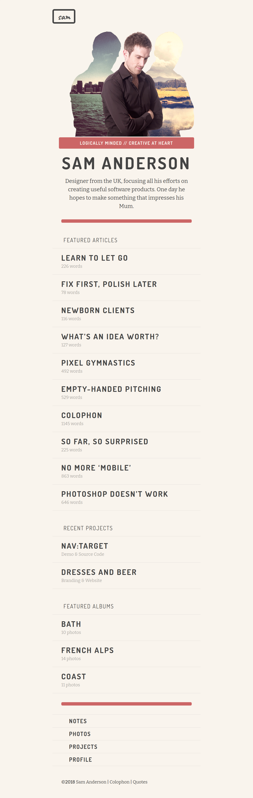

# Sam Anderson Portfolio Mastery Challenge

## Context
Sam Anderson is a Graphic Designer working in UK. He works towards building great user-experiences for his customers. Sam now plans to expand his work in and outside UK by having web presence showcasing his work. Being a Graphic Designer Sam was able to design the layout for his webpage but needed help in scripting the markup and styles to realize the design.

## Challenge
Sam had assigned this work to a local FrontEnd Developer, but the developer had some challenges and unfortunately could only produce the markup. Sam, now needs help in styling the `./index.html` in a way that resembles the image below such that he can publish his website.

### Details
- There are 4 fonts which are widely used across the page and they can be found at following locations:
    - FontAwesome -  https://netdna.bootstrapcdn.com/font-awesome/3.2.1/css/font-awesome.css (icon-pencil, icon-user, icon-lightbulb, icon-camera-retro)
    - Caveat - https://fonts.google.com/specimen/Caveat
    - Dosis - https://fonts.google.com/specimen/Dosis
    - Bitter - https://fonts.google.com/specimen/Bitter
- Color Codes frequently used on the page
    - Light Gray - rgba(0,0,0,0.1)
    - Dark Gray - rgba(0,0,0,0.35)
    - [#c66](./c66.png)
    - [#F9F4ED](./f9f4ed.png) 
    - [#444](./444.png)
- Images used across the page
    - [City-Mountain-Sam](./city-sam-mountain.png)

**Sam wants his Portfolio to resemble the image given below.**

